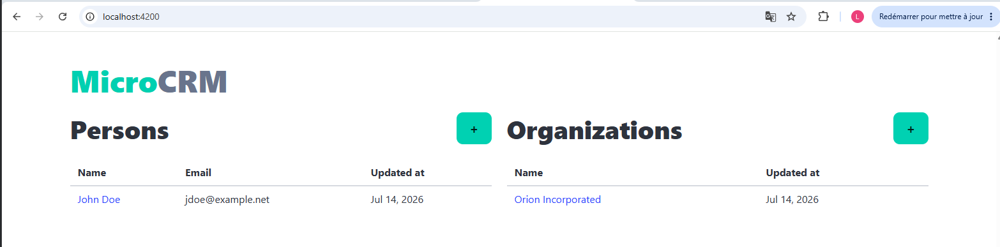
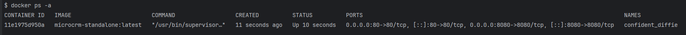
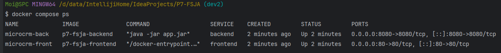

# main
1. Application de README.md
- Démarrer le backend  : $ java -jar build/libs/microcrm-0.0.1-SNAPSHOT.jar
- Démarrer le frontend : $ npx @angular/cli serve
- http: http://localhost:4200/  
Image  

# dev1 
1. Analyse du fichier Dockerfile :
   - Trois images : 
    orion-microcrm-front : Linux Debian 12, Node.js version 22, Caddy + ressource Angular html
    orion-microcrm-back  : Linux Ubuntu 22.04, Gradle 8.7, Java + ressource Spring-boot app.jar
    orion-microcrm-standalone : images de front et back + supervisor
    Conclusion : Il y a des erreurs ( EXPOSE 4200 pour le back) 
  
   
2. Refonte du fichier Dockerfile : 
   - Remplacer les distibutions Linux
   - Remplacer Caddy par Nginx

   - $ docker build --target front -t microcrm-front .
   - $ docker run -it --rm -p 80:80 microcrm-front:latest
   
   - docker build --target back -t microcrm-back:latest .
   - docker run -it --rm -p 8080:8080 microcrm-back:latest  

    

   - docker build --target standalone -t microcrm-standalone:latest .
   - docker run -it --rm -p 8080:8080 -p 80:80  microcrm-standalone:latest  
     
   
 # dev2
1. Implémentation : 
  - front/Dockerfile,front/Dockerfile front/.dockerignore
  - back/Dockerfile,back/Dockerfile back/.dockerignore
  - docker-compose.yml

2. Lancement de l'application avec Docker compose
   - $ docker compose up -d   
   - Verification : docker compose ps :
   

# dev3
1. Implémentation Pipeline CI pour le backend
  - Error droit d'exécution gradlew : 
  - Afficher droit gradlew dans pipeline : 
  - Forcer droit exécution Git INDEX : 
  - ci_forcer_git_indew.yml
  - Analyse ci.yml par rapport aux étapes dans Github Action : 
    - ci_backen_analyse_Github_Action.md
    - 
    
  - Test Pull Request avec la branche test-ci
    pull_requests_dev3.md :
    -       
    -  
    - 
    - 
    - 
    - 
    - 
    - 
      pull_requests_sonaCloud.md : 
2. Ajout test couverture JaCoCo

# dev4 
1. Implémentation sonacloud dans ci
2. Test JaCoCo : couverture 89%

# dev5 
1. Implémentation frontend dans le CI

